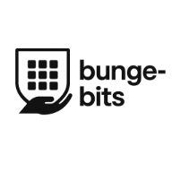

  

# Bunge Bits

Bunge Bits provides convenient summaries of Kenyan National Assembly and Senate proceedings, making legislative information more accessible and digestible.

## Motivations

The driving force behind Bunge Bits is to strengthen Kenya's democracy by making legislative processes more transparent and understandable to all citizens. The aim is to bridge the gap between complex government proceedings and the average Kenyan, fostering increased civic engagement and political awareness. By offering concise, easy-to-digest summaries of legislative sessions, I hope to empower citizens with the knowledge they need to participate more fully in their democracy, hold elected officials accountable, and engage in informed discussions about the issues that affect their lives.

Ultimately, Bunge Bits seeks to contribute to a more engaged, informed, and participatory democratic process in Kenya.

## Development Progress

- [x] `ytInitialData` parser: Parsing logic that parses scraped data from youtube
- [x] `stream_datastore`: ~Sqlite~ Postgres database bindings for storing, retrieving and modifying stream data
- [x] `yt-dlp` bindings: Bindings to interact with the yt-dlp cli as well as some utilities to interact with video and vtt data
- [x] `ffmpeg` bindings: Bindings to complement the Ytdlp bindings for the purpose of processing audio
- [x] `stream_pulse_cron`: A cron job that periodically fetches and processes streams
- [x] `stream_digest`: Functions that make it possible to efficiently process transcripts in chunks
- [x] LLMs: A service that interacts with OpenAI's Whisper and ChatGPT 4o to handle transcribing and summarizing the downloaded audio
- [x] Manual publish flag – `is_published` field added to each stream for editorial control. Yes it sucks, but it's necessary for now since LLMs don't seem to get everything 100% right. Only a temporary step for now though.
- [ ] Web App: The end user interface that will display the summarized content [#3](https://github.com/c12i/bunge-bits/issues/3)
- [ ] Email Newsletter – Periodic delivery of new summaries to subscribers

## Development Setup

- [`stream_pulse`](./crates/stream_pulse/README.md#development-setup)
- [`ui`](./ui/README.md)

## Contribution

See the [contribution guideline](./CONTRIBUTING.md).

## Blog Posts

- [Building bunge-bits, an AI-Powered Summary Pipeline for the Parliament of Kenya](https://collinsmuriuki.xyz/building-bunge-bits/)

## Support the Project

Your support helps cover:

- Cloud hosting and database infrastructure
- OpenAI Whisper + GPT 4o API usage

Sponsorship is available via [Buy Me a Coffee](https://buymeacoffee.com/c12i). Every bit helps to keep Kenyan legislative content accessible to all.
